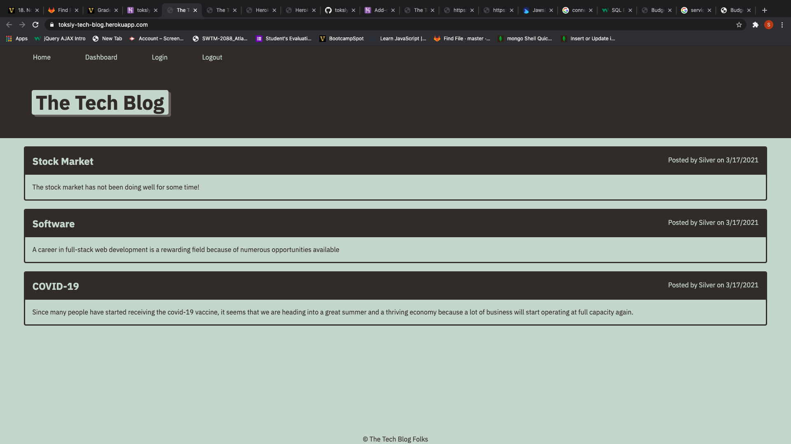

# tech-blog
<strong>tech-blog</strong>
The name of this application is <i>tech-blog</i> it is designed to help developers publish their blog posts as well as to be able to comment on other developer's  posts.

<strong>Image</strong>

<strong>Description</strong>
This application allows developers to be able to publish,articles, posts, thoughts and opinions.
<strong>Technology used</strong>
 Javascript, handlebars, sequelize and node.js . 

<strong>Installation</strong>

This project does not need any installation,rather it is currently hosted at Heroku via this link
https://toksly-tech-blog.herokuapp.com/
<strong>Usage</strong>

This application is easy to use. It allows first time users to be able to create an accout using a username and a password, while returning users can simply login on the homepage using username and password credentials. After logging in, a user can be able to write a post, update and delete. The user can also comment on others posts

<strong>Support and Contribution</strong>
If you have any question please email me at nwizutoks@gmail.com
